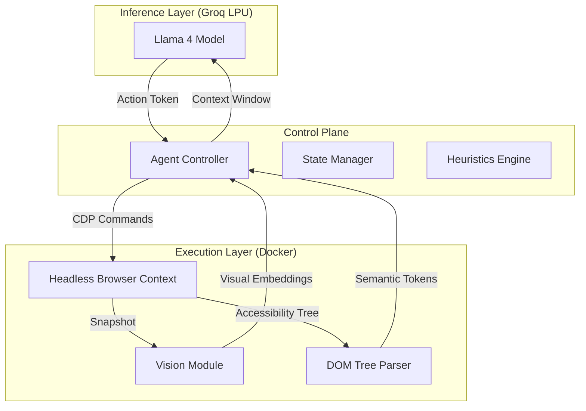

# ✈️ Flight-CUA-Engine

[](https://arxiv.org/abs/2406.00000)
[](https://groq.com/)
[](https://ai.meta.com/)

> **A deterministic Computer Use Agent (CUA) implementing Large Action Model (LAM) paradigms for autonomous DOM manipulation and flight vector optimization.**

## ⚡ Technical Abstract

**Flight-CUA-Engine** is a high-throughput autonomous agent framework designed to solve the *dynamic DOM traversal problem* in complex web applications. Unlike traditional scraping heuristics (XPath/CSS selectors) which are brittle to UI mutations, this engine leverages **Multimodal Large Language Models (MLLMs)** to semantically understand portions of the Viewport, allowing for resilient, human-like interaction flows.

Powered by **Groq's LPU (Language Processing Unit)** hardware, the system achieves sub-second inference latencies, enabling real-time decision loops required for successfully navigating time-sensitive asynchronous UI states.

## 🏗️ System Architecture

The architecture implements a **Perception-Action Loop** utilizing a headless browser containerized via Docker.



## 🚀 Key Engineering Capabilities

-   **Zero-Shot DOM Navigation**: Navigates previously unseen UI patterns using semantic reasoning rather than hardcoded paths.
-   **Chain-of-Thought Planning**: Decomposes complex booking queries into atomic browser actions (Click, Type, Scroll, Wait).
-   **Self-Correction Protocols**: configuration parameters allowing the agent to detect execution failures (e.g., modal interceptions) and replan autonomously.
-   **High-Concurrency Design**: Asynchronous IO loop optimized for Python 3.11+, capable of handling multiple context streams.

## 🛠️ Technology Stack

| Component | Technology | Role |
| :--- | :--- | :--- |
| **Runtime** | Python 3.11 (AsyncIO) | Core Agent Logic |
| **Orchestration** | Docker | Browser Environment Isolation |
| **Inference** | Groq API (Llama-4-Scout) | 30,000+ TPM (Tokens Per Minute) |
| **Protocol** | Chrome DevTools Protocol (CDP) | Low-level Browser Control |
| **Framework** | LangChain / Browser-Use | ReAct Paradigm Implementation |

## 📦 Installation & Deployment

### Prerequisites
-   Docker Daemon (running)
-   Python 3.11+ environment
-   Groq API Credential

### Setup

```bash
# Clone the repository
git clone https://github.com/Ranga-Prasath-22/Flight-CUA-Engine.git

# Initialize virtual environment
python -m venv venv
source venv/bin/activate  # or venv\Scripts\activate on Windows

# Install dependency graph
pip install -r requirements.txt

# Configure environment variables
echo "GROQ_API_KEY=your_key_here" > .env
```

### Execution

```bash
python main.py
```

## 📄 License

MIT License.
