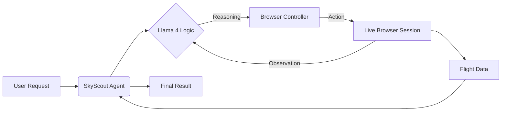

# ✈️ SkyScout AI

[](https://www.python.org/downloads/)
[](https://groq.com/)
[](https://github.com/browser-use/browser-use)
[](https://opensource.org/licenses/MIT)

> **Autonomous Flight Intelligence powered by Next-Gen Generative AI.**

## 🚀 Overview

**SkyScout AI** is an intelligent autonomous agent designed to revolutionize how we search for flights. By leveraging the extreme inference speed of **Groq** and the advanced reasoning capabilities of **Llama 4**, this agent autonomously navigates complex web interfaces in real-time to locate the optimal flight parameters for any given itinerary.

Unlike traditional scrapers that break with UI changes, SkyScout AI "sees" and "understands" the web page just like a human, but with the speed and precision of a machine.

## ✨ Key Features

-   **🧠 Cognitive Navigation**: Uses Multimodal LLMs to understand DOM structures and visual context.
-   **⚡ Hper-Fast Inference**: Powered by Groq's LPU (Language Processing Unit) for near-instant decision making.
-   **🛡️ Self-Healing**: Automatically detects and handles pop-ups, dynamic content, and anti-bot measures (via Dockerized browser isolation).
-   **🔌 Plug-and-Play**: Simple architecture designed for easy extensibility to other domains beyond travel.

## 🛠️ Technology Stack

-   **Core Logic**: Python 3.11+
-   **Inference Engine**: [Groq API](https://groq.com/) (Llama-4-Scout-17b)
-   **Agentic Framework**: [Browser-Use](https://github.com/browser-use/browser-use) (LangChain integration)
-   **Orchestration**: Docker (Containerized Browser Environment)

## ⚡ Quick Start

### Prerequisites

-   Python 3.11+
-   Docker Desktop (Running)
-   Groq API Key

### Installation

1.  **Clone the Repository**
    ```bash
    git clone https://github.com/Ranga-Prasath-22/SkyScout-AI.git
    cd SkyScout-AI
    ```

2.  **Install Dependencies**
    ```bash
    pip install -r requirements.txt
    ```

3.  **Configure Environment**
    Create a `.env` file in the root directory:
    ```env
    GROQ_API_KEY=your_groq_api_key_here
    ```

4.  **Run the Agent**
    ```bash
    python main.py
    ```

## 🏗️ Architecture



## 🤝 Contributing

Contributions are welcome! Please feel free to submit a Pull Request.

## 📄 License

This project is licensed under the MIT License - see the [LICENSE](LICENSE) file for details.

---

<p align="center">
  Generated with ❤️ by <a href="https://github.com/Ranga-Prasath-22">Ranga Prasath</a>
</p>
